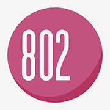
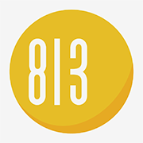
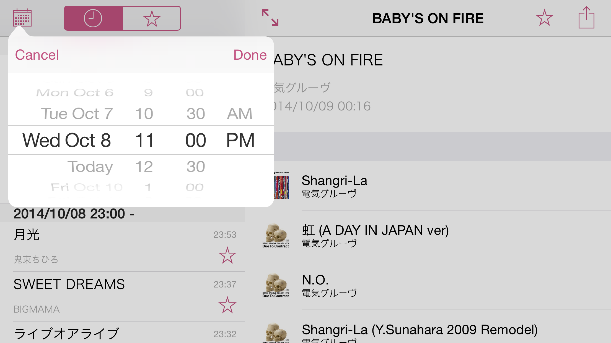

OnAirLog for iOS
================

FM で放送された楽曲を検索できる、シンプルな iOS アプリ。

[][appstore802]&nbsp;&nbsp;
[][appstore813]

Author
======

[Atushi Nagase]

License
=======

Copyright &copy; 2014 [Atushi Nagase]. All rights reserved.

[appstore813]: http://itunes.apple.com/jp/app/onairlog813/id416761694?mt=8
[appstore802]: http://itunes.apple.com/jp/app/onairlog802/id423580398?mt=8
[Atushi Nagase]: http://ngs.io/
